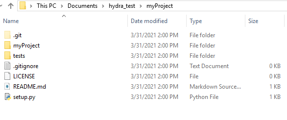

# hydra
*hydra* is a command line utility for generating language-specific project structure.


⏬



<br>

## Installation
### Method 1
- Download the latest exe release of *hydra* suitable for your OS from [here](https://github.com/Shravan-1908/hydra/releases/latest).

- Rename the downloaded file to `hydra`.

- Add the directory where *hydra* is downloaded to the `PATH` variable of your system, so that you can call hydra in any directory via a terminal. If you don't know how to setup the `PATH` variable, refer these links for [Windows](https://helpdeskgeek.com/windows-10/add-windows-path-environment-variable/), [macOS](https://phoenixnap.com/kb/set-environment-variable-mac) and [Linux](https://opensource.com/article/17/6/set-path-linux).

- To verify installation of *hydra*, open a new shell and execute `hydra -v`. You should see output like this:
```
hydra 2.0.0

Version: 2.0.0
```
If the output isn't something like this, you need to repeat the above steps carefully.


### Method 2
If you've Go installed on your system, execute:

`go get github.com/Shravan-1908/hydra`

You don't need to change the PATH variable in this case, as Go will automatically build and add the executable in the $GOPATH/bin directory.

<br>

## Usage
This section shows how you can use *hydra*.

### config
The `config` command is used to set or alter the hydra user configurations.

`$ hydra config {flags}`

The valid flags for config command are:
- `name` --> The name of the user.
It is used as the name of the copyright holder in the LICENSE file.

- `github-username` --> The Github username of the user.
It is used to initiate the modules in go.

- `default-lang` --> The default language for project initialisation. It is used in case the `lang` argument is not provided in the `init` command. Valid options for the `default-lang` flag are:
    * go
    * python

- `default-license` --> The default license for project creation. Valid values are:
    * MIT
    * GPL
    * BSD
    * APACHE
    * EPL
    * MPL

Once hydra is installed, it is advised to run the following command to complete the configuration.

`$ hydra config --name "YOUR NAME" --github-username "YOUR GITHUB USERNAME"`


### list
The `list` command is used to list supported languages, licenses and the hydra user configurations.

`$ hydra list <item>`

Valid options for the `item` argument are:
- langs --> Languages supported by hydra
- licenses --> Licenses supported by hydra
- configs --> The hydra user configurations

Example: `hydra list langs`

### init
To create a new project structure using *hydra*,
execute:

`$ hydra init <project name> [lang]`

The `init` command initialises the project.


Valid options for the language argument are:
- python
- go

Example: `hydra init myProject python`

In case the `lang` argument is not provided, hydra falls back to the `default-lang` configuration.

*hydra* currently supports only python and go for project creation. But, as new versions are published, support for more languages/frameworks will be added.


### version
`$ hydra version`

The version command shows the version of *hydra* installed.

### help
`$ hydra help`

Renders assistance for *hydra* on a terminal, briefly showing its usage.

<br>

## Change Log
The changes made in the latest version of hydra, *v2.0.1* are:

- Made a separate 'list.go' file for the `list` command
- CI build bug fix (redefined embed paths for licenses and gitignores)

View [CHANGELOG.md](CHANGELOG.md) for more information.

<br>

## Versioning
*hydra* releases follow semantic versioning, where every release is in the *x.y.z* form, where:
- *x* is the MAJOR version and is incremented when a backwards incompatible change to hydra is made.
- *y* is the MINOR version and is incremented when a backwards compatible change to hydra is made, like changing dependencies or adding a new function, method, struct field, or type.
- *z* is the PATCH version and is incremented after making minor changes that don't affect hydra's public API or dependencies, like fixing a bug.

<br>

## License
License
© 2021 Shravan Asati

This repository is licensed under the MIT license. See [LICENSE](LICENSE) for details.

<br>

## Contribution
Pull requests are more than welcome. For more information on how to contribute to *hydra*, refer [CONTRIBUTING.md](CONTRIBUTING.md).