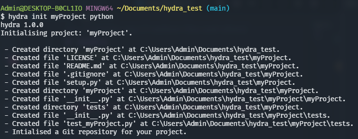

# hydra
*hydra* is a command line utility for generating language-specific project structures.



⏬


<br>

## ✨ Features

- Build project templates with just one command
- Support for seven different licenses
- Language-specific `.gitignore` file
- Configure default language and default license to work with
- Fast and reliable

<br>

## ⚡️ Installation

**For Linux users:**

Execute the following command in bash:

```bash
curl https://raw.githubusercontent.com/Shravan-1908/hydra/main/linux_install.sh > hydra_install.sh

chmod +x ./hydra_install.sh

bash ./hydra_install.sh
```


**For MacOS users:**

Execute the following command in bash:

```bash
curl https://raw.githubusercontent.com/Shravan-1908/hydra/main/macos_install.sh > hydra_install.sh

chmod +x ./hydra_install.sh

bash ./hydra_install.sh
```

**For Windows users:**

Open Powershell **as Admin** and execute the following command:
```powershell
Set-ExecutionPolicy Bypass -Scope Process -Force; (Invoke-WebRequest -Uri https://raw.githubusercontent.com/Shravan-1908/hydra/main/windows_install.ps1 -UseBasicParsing).Content | powershell -
```

To verify the installation of *hydra*, open a new shell and execute `hydra -v`. You should see output like this:
```
hydra 2.2.0

Version: 2.2.0
```
If the output isn't something like this, you need to repeat the above steps carefully.


<br>

## 💡 Usage
This section shows how you can use *hydra*.

### config
The `config` command is used to set or alter the hydra user configurations.

`$ hydra config {flags}`

The valid flags for config command are:
- `name` --> The name of the user.
It is used as the name of the copyright holder in the LICENSE file.

- `github-username` --> The Github username of the user.
It is used to initiate the modules in go.

- `default-lang` --> The default language for project initialisation. It is used in case the `lang` argument is not provided in the `init` command. Valid options for the `default-lang` flag are:
    * go
    * python
    * web
    * flask
    * c
    * c++
    * ruby

- `default-license` --> The default license for project creation. Valid values are:
    * MIT
    * GPL
    * BSD
    * APACHE
    * EPL
    * MPL
    * UNI

Once hydra is installed, it is advised to run the following command to complete the configuration.

`$ hydra config --name "YOUR NAME" --github-username "YOUR GITHUB USERNAME"`


### list
The `list` command is used to list supported languages, licenses and the hydra user configurations.

`$ hydra list <item>`

Valid options for the `item` argument are:
- langs --> Languages supported by hydra
- licenses --> Licenses supported by hydra
- configs --> The hydra user configurations

Example: `hydra list langs`

### init
To create a new project structure using *hydra*,
execute:

`$ hydra init <project name> [lang]`

The `init` command initialises the project.


Valid options for the language argument are:
- python
- go
- web
- flask
- c
- c++
- ruby

Example: `hydra init myProject python`

In case the `lang` argument is not provided, hydra falls back to the `default-lang` configuration.

You can view the [structures.md](structures.md) file to see the project structure hydra creates for every language it supports.


### version
`$ hydra version`

The version command shows the version of *hydra* installed.

### help
`$ hydra help`

Renders assistance for *hydra* on a terminal, briefly showing its usage.

<br>

## ⏩ Change Log
The changes made in the latest version of hydra, *v2.2.0* are:

- Added flask (python web framework), C, C++, and ruby as language types for project initialisation
- Improved web initialisation
- Added support for Unilicense
- Changed the hydra config directory

View [CHANGELOG.md](CHANGELOG.md) for more information.

<br>

## 🔖 Versioning
*hydra* releases follow semantic versioning, every release is in the *x.y.z* form, where:
- *x* is the MAJOR version and is incremented when a backwards incompatible change to hydra is made.
- *y* is the MINOR version and is incremented when a backwards compatible change to hydra is made, like changing dependencies or adding a new function, method, struct field, or type.
- *z* is the PATCH version and is incremented after making minor changes that don't affect hydra's public API or dependencies, like fixing a bug.

<br>

## 📄 License
License
© 2021-Present Shravan Asati

This repository is licensed under the MIT license. See [LICENSE](LICENSE) for details.

<br>

## 👥 Contribution
Pull requests are more than welcome. For more information on how to contribute to *hydra*, refer [CONTRIBUTING.md](CONTRIBUTING.md).
